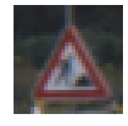
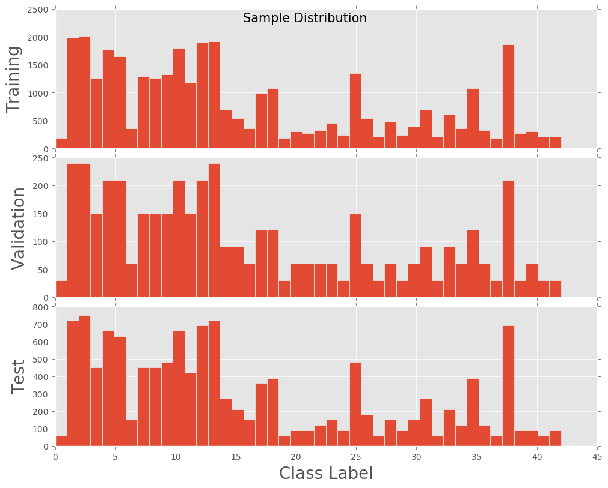
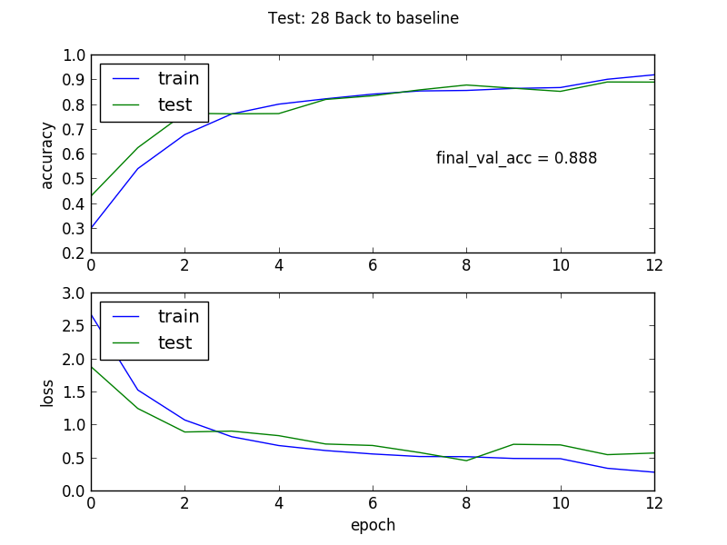
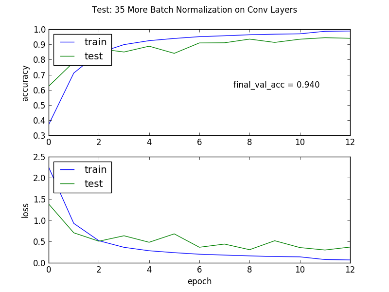

# Traffic Sign Recognition

This is the writeup for my second project in Udacity's Self-Driving-Car nanodegree.

The project code, written in jupyter, can be seen using NBViewer [here](https://nbviewer.jupyter.org/github/Eq1nimity/CarND-P2-Traffic-Sign-Classifier-Project/blob/master/Traffic_Sign_Classifier.ipynb). 

## Summary

1. Explore, summarize and visualize the data set
2. Design, train and test a model architecture
3. Make predictions and analyze softmax on new images

## Data Set Summary & Exploration

---

### 1. Basic summary of the data set.

Using numpy's ndarray.shape method, I determined the following:

- Number of training examples = 34799
- Number of testing examples = 12630
- Image data shape = (32, 32)

Using pythons len() and set() functions, I determined:
- Number of unique classes = 43

### 2. Exploratory visualization of the dataset.

First, I grabbed a random sample from the training data, and displayed it.

Next, I wanted to see the class distribution over the training, validation and test data sets.

## Design and Test a Model Architecture

---

### 0. Intro

I decided to implement my model in keras because I wanted to use:

- keras.preprocessing.image's class, ImageDataGenerator()
- keras.model.Sequential()'s method, fit_generator.

However, in the the final model I used neither of these. However, I learned all about them, so no harm done. :)

### 1. Preprocessing

I decided for minimal preprocessing, as I wanted to get a base line with as simple implementation as possible, and that turned out to be sufficient. I simply included best practices; to include normalization, regularization and shuffling of the data.

#### Shuffle
Most keras methods have a kwarg shuffle, which is default true. I have not noted these instances in the code.

#### Normalization
I implemented a BatchNormalization layer as the intial layer of my model. This makes the mean and stddev close to zero and one respectively.

As a result of some spotty experiments, I also included two more instances of BatchNormalization inside of the two convolutional layers, as this yeilded better performance. I found no value, or decreased value in using batch normalization on the fully connected layers in addition too the convolutions, or instead of the convolutions. I plan to experiment intra layer batch normalization with more rigor in the future.

#### Regularization
In the first convolutional layer, I included an L2 regularization. I did not experimentally test this across other layers. This will also be experimented further in the future.

### Augmentation Summary

Ultimately, I did not use augmentation in my final mode. As I had sufficient accuracy on the unaugmented data. However, I explore reasons why it might not have worked, and how it could have been implemented with potentially benefitial results below.

Initially, given the difference between the different class samples, I thought that ambitiously augmenting (4-8x) the underrepresented classess to give more equal distribution of class samples would increase the performance of the classifier.

However, after testing it turned out not to be the case. Most attempts at running augmented data through this pipeline ruined the classifier, at best resulting in a validation accuracy below 40%. Though, this alone doesn't disprove the hypothesis, as my experimental implementation left much to be desired.

A few speculations as to why my augmentation process was not successful:

1. The "underrepresented classes" are not underrepresented relative to the test set, only relative to the classess with more samples. This might actually reflect a real world distribution, and therefor being more bias toward the classess with more samples is probably better in application.

2. In contrast to point 1, I feel a sufficiently trained classifer shouldn't have this issue anyway; it should recognize a sign if its trained to recognize signs, the bias of frequency shouldn't be significant. Therefore, perhaps it was then just simply bad augmentation parameters because something such as the random rotation degree was too high to have a realistic representation. Or, perhaps insufficient variations, because no change in color, brightness, or contrast was applied. It might be worth exploring the more potential augmentation types and tuning parameters further at a later time.

3. The augmentation volume might have been too high. By trying to increase the underrepresented classess factor of 4-8, I probably just ruined the variance in the data because of an insufficient augmentation pipeline. Perhaps a better pipeline, with a less ambitous augmentation volume, would yeild modest improvements to the classifier.

That being said, given 2 and 3 above, a finer tuned experimental process might include:

1. A broader selection of augmentations.
2. Finer tuned augmentation parameters.
3. Apply to all classes of the data.
4. Apply only to a modest degree such as 1.2-1.5x

More information reguarding implementing ImageDataGenerator() for data augmentation can be found on the keras blog, [Building powerful image classification models using ver little data.](https://blog.keras.io/building-powerful-image-classification-models-using-very-little-data.html)

### 2. Model Architecture

I took the Lenet from the MiniFlow lab and recreated it in Keras. Some deviations such as more convolutional layer depth, and BatchNormalization before the second convolutional layers activation were implemented. It's however, more or less Lenet.  

|Layer|	Description|
|---|---:|
|Input/Normalize| 32,32,3 RGB, Normalized|
|Conv 1| 128 kernal depth, 5x5 kernal size, 2x2 strides, padding=same, L2 Reg, glorot normal initialized weights |
| BatchNormalization | Might be redundant. |
|Activation | Relu|
|Max Pool 2d| 2x2 pool size|
| Conv2| 128 Kernal Depth, 5x5 kernal size, 1x1 strides, padding=same|
|Batch Normalization | To normalize outputs of previous activation|
|Max Pool 2d| 2x2 pool size|  
|Flatten Layer | To prep for FC layers|
|FC1: Dense| 400 output depth|
|Activation | Relu|
|Dropout| 50%|
|FC2: Dense| 120 output depth|
|Activation | Relu|
|Dropout| 10%|
|FC3: Dense| n_classes (43) output depth)
|Activation| Softmax|

The loss reduction elements consist of:
|What|Why|
|---|---|
|Loss: sparse_categorical_crossentropy| To work with discrete class output from softmax. It's more or less "one hot".  |
|Optimizer: rmsprop | I don't know why, but it works better with a softmax activation on final output layer. I tested it against adam and it performed better.|

### 3.Training & validation
I like to combine the training and validation stages to decrease experiment latency.

#### Overview
Initially I had a really bad model. I was using the wrong activations, with the wrong loss, and the wrong optimzer for this problem. After researching, I realized how I had deviated from Lenet in my conversion to Keras. That was discarding the softmax and onehot encoding. After applying a softmax activation to the last layer, using sparse_categorical_crossentropy for my loss, and and applying rmsprop as an optimizer. I was getting resonable performance of about ~88% validation accuracy.

My first approach (iteration cycle) was not to fix or adjust the model, rather it was to augment the data (information found above). When this yeilded even worse results. I realized that it was my model that was bad, not the data.

After fixing the model I was able to properly test my augmentation pipeline, and realized how bad it actually was. Though, by this time I was getting 93-95% accuracy, so my desire to troubleshoot that sort of diminished given the timeline I left myself to complete these projects.

The biggest breakthrough for me (and my validation accuracy) was applying standard best practice preprocessing. I reviewed a supplementary lecture by [Martin Gorner: Deep Learning without a phd](https://www.youtube.com/watch?v=vq2nnJ4g6N0). I then applied batch normalization, regularization and immidiately found out why they are best practices. Of course, these were also discussed in the Udacity material, I just didn't remember what they were and I recalled a section of this lecture where he worked through refining a network.

The lessons I learned that day exceed the domains of deep learning.  

#### Experimental Process
My experimental process involved a (very) crude experiment protocol. Here is what a typical run entitled:

1. Hypothesize and plan experiment on loose paper.  
2. Change model accordingly
3. Fit and validate
4. Update test key
5. Vizualize run with plt and save plot in test log.
6. Repeat

This worked okay, most epochs took ~4-8s. Only the last runs where I upped the filter count did they take longer (~15s). I learned a lot of things during this project, such as the downsides to using looseleaf paper for a lab notebook. I have taken significant refinment steps in my experimental workflow, and am very excited about applying them in the future!

The test_logs dir has been included in the repo, but its not really documented aside from a half encoded title.

As stated above, the most significant was the application of batchnormalization and regularization.

Here was the latest baseline:

After (re)discovery of BN and L2 Reg. Finally above the 93% threshold!

#### Other Noteworthy Implementations.

Clearly, batch normalization and regularization was necessary. However, dropout also gave me really good results in my initial testing. It was the only time I broke the 90% threshold prior to implementing BN and reg. I also found that increasing the kernal depth of the conv layers allowed me to get a higher accuracy.

Additionally, reducing the learning rate after validation loss stopped decreasing consistantly improving the accuracy by a modest amount. I tried this early on and left it through most of my experiments. I used ReduceLROnPlateau from keras.callbacks for this, with a patience of 1 (how many epochs with no improvement before implementing) and decrease LR factor of 0.5.

I played around with the epochs and found 13 sufficient for reducing experimental latency, while ensuring adequate training time. 10 was too low, sometimes variance occured (keras shuffles alot) and two identical models required as many as two more epochs between run variance. As any more usually only increased performance by a few 10ths of percent. The final model ran for 15, full convergance was almost always achieved by this point, and any more was uncessary.  

#### Final Model Results

- training set accuracy of: 0.9930
- validation set accuracy of: 0.9519
- test set accuracy of: 0.9501

## Test a Model on New Images

---

### 1. Choose five new German traffic signs.

Here are five German traffic signs that I found on the web:

The first image might be difficult to classify because ... well, it probably wont be. The ones that I picked I picked because they looked good to me. I didn't really think to test on difficult signs, though now I see how much fun that would have been! I even cropped them nicely in gimp, heh. I suppose I could go back and have more fun by altering these.

### 2. Analyze

The model perfectly recognized 5/5 signs. I unskillfully made it an easy test, however.

### 3. Softmax Probabilities

This was fun, because initially had no idea how to translate this into my keras model. However, after a healthy dose of careful procrastination, I stumbled into a working solution.

As it turns out, I was able to pretty much use tf.nn.top_k out of the box in a tf.Session(). I just needed to run a prediction using on my keras model, and take that output and run it through tf.nn.top_k. This works because model.predict simply returns the probability predictions of the of the model. The result isn't pretty, it used exponential notation with a lot of uneccessary significant figures at this point, but they are the correct class probabilities.

This was a much shorter and easier alternative than trying to take the top five out of keras's own predict_proba, as it returns a massive array of probabilities which would need parsing.
